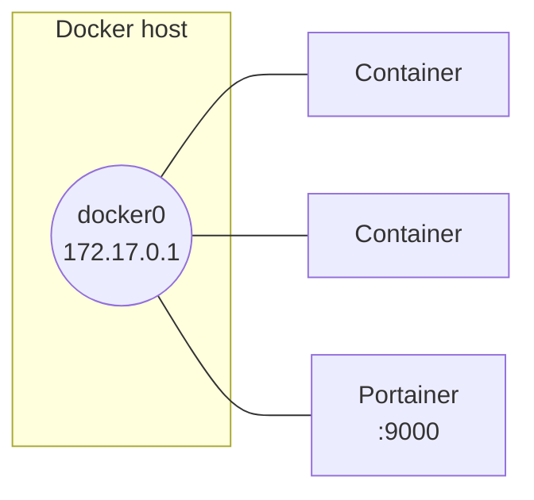

# Docker

## Prerequisites

- Linux host (tested on Ubuntu Server, no graphical mode), root or sudo access
- Basic Linux administration and virtualization knowledge
- An SSH client with copy/paste (MobaXterm or similar) makes typing commands easier

## Installation

```bash
apt install apt-transport-https ca-certificates curl software-properties-common
curl -fsSL https://download.docker.com/linux/ubuntu/gpg | sudo gpg --dearmor -o /usr/share/keyrings/docker-archive-keyring.gpg
echo "deb [arch=$(dpkg --print-architecture) signed-by=/usr/share/keyrings/docker-archive-keyring.gpg] https://download.docker.com/linux/ubuntu $(lsb_release -cs) stable" | sudo tee /etc/apt/sources.list.d/docker.list > /dev/null
apt update
apt-cache policy docker-ce
apt install docker-ce
systemctl enable docker
```

`apt-cache policy docker-ce` confirms which version will be installed before you commit. `systemctl enable docker` makes the service start automatically on boot.

## Default network

On install, Docker creates a `docker0` interface and a bridge network of the same name. Unless told otherwise at launch, every container attaches to it and can reach the other containers on that network.



```bash
ip a show docker0
```

If `172.17.0.0/16` conflicts with an existing addressing plan, the `/etc/docker/daemon.json` file (absent by default) lets you change it:

```bash
sudo nano /etc/docker/daemon.json
```

```json
{
  "bip": "<ip-address>/24"
}
```

```bash
systemctl daemon-reload
service docker restart
ip a show docker0
```

!!! warning "Connectivity drops while it restarts"
    `service docker restart` briefly interrupts `docker0` and cuts networking for every running container while the daemon restarts. The containers themselves don't stop, but their active network connections (Portainer included) only come back once the service is back up.

!!! warning "Rolling back"
    Deleting the file directly isn't always enough. First set `bip` back to its default value, restart, verify, and only then delete the file:

    ```json
    {
      "bip": "172.17.0.1/16"
    }
    ```

    ```bash
    systemctl daemon-reload
    service docker restart
    rm -f /etc/docker/daemon.json
    ```

## Web interface: Portainer

Everything about managing Docker can be done from the command line; Portainer adds an equivalent web interface.

```bash
docker pull portainer/portainer-ce
docker images
docker run -d -p 9000:9000 --name portainer --restart always \
  -v /var/run/docker.sock:/var/run/docker.sock \
  -v portainer_data:/data \
  portainer/portainer-ce
docker ps
```

Then access it from a browser on the host machine: `http://<server-ip-address>:9000`. The admin password is set the first time you open the interface.

## Images

```bash
docker search <term>
docker pull <image>
docker images
docker inspect <image>
docker info
```

`docker inspect` gives the full configuration of an image; `docker info` shows, among other things, where images and containers are stored on the host.

## Containers — lifecycle

```bash
docker run <image> <command>                   # runs the command then stops the container
docker ps                                      # running containers
docker ps -a                                   # every container, including stopped ones
docker run --name <container> <image> <command>
docker logs <container>
docker rm <container>                          # or: docker rm <id>
```

```bash
docker run --name <container> -i -t <image>    # interactive shell in a new container
```

To exit without stopping the container: ++ctrl+p++ then ++ctrl+q++ (detaches the console). `exit`, on the other hand, closes the shell **and** stops the container if it has no other active process.

```bash
docker start <container>                       # restart without an interactive shell
docker start -i <container>                    # restart with an interactive shell
docker stop <container>
docker attach <container>                      # reopen a console on a running container
docker exec -it <container> /bin/bash          # or: open a new shell inside the container
docker pause <container>                       # suspend every process in the container
docker unpause <container>
```

!!! danger "Don't run this outside a deliberate test"
    ```bash
    docker rm $(docker ps -aq)
    ```
    Removes every container on the host, no exceptions — including ones from an interface like Portainer.

## Sharing a host directory with a container

```bash
mkdir <host-directory>
chmod 777 <host-directory>
docker run -it --name <container> -v <host-directory>:<container-directory> <image>
```

The container gets read/write access to the host directory through the mount point given. A file created on one side shows up immediately on the other.

```bash
docker run -it --name <container> -v <host-directory>:<container-directory>:ro <image>
```

The `:ro` suffix mounts the share read-only — any write attempt from that container fails.

## Saving a modified container as a new image

```bash
docker commit <container> <new-image>
```

!!! note "The image name must be lowercase"
    `docker commit` rejects an image name containing uppercase letters.

```bash
docker tag <new-image> <new-image>:<tag>
docker save <new-image>:<tag> > <archive-path>.tar
docker rmi <new-image>:<tag>
docker load < <archive-path>.tar
```

`save`/`load` export and reimport an image as a `.tar` archive, useful for moving it to a host with no access to the original registry.

## Rollback plan

To remove a specific container or image, `docker rm <container>` and `docker rmi <image>` are enough — see the sections above. To uninstall Docker from the host entirely:

```bash
docker rm -f $(docker ps -aq)
docker rmi -f $(docker images -q)
docker volume prune -f
apt purge docker-ce docker-ce-cli containerd.io
rm -rf /var/lib/docker /etc/docker
```

!!! danger "Irreversible"
    This sequence removes every container, image, and volume on the host, including ones unrelated to this page. Reserve it for a deliberate, complete uninstall, never for a partial rollback.

If only the `docker0` network was customized (`/etc/docker/daemon.json`), the more targeted approach is already covered in the *Rolling back* box under [Default network](#default-network).

## Verification

```bash
docker ps -a
docker images
docker network ls
docker network inspect bridge
docker volume ls
```

## Troubleshooting

| Symptom | Likely cause | Fix |
|---|---|---|
| `/etc/docker/daemon.json` not found | File absent by default, needs creating | Create it with the expected content, then `systemctl daemon-reload` and `service docker restart` |
| Changing `bip` has no effect on `docker0` | Service not reloaded after the change | `systemctl daemon-reload` then `service docker restart`, check with `ip a show docker0` |
| `docker commit` refused | Image name contains an uppercase letter | Rewrite the name entirely in lowercase |
| Write refused inside a mounted volume | Mounted read-only (`:ro`) | Expected behavior; remount without `:ro` if writing is needed |
| The container stops when leaving the shell | Exited with `exit` instead of detaching | Use ++ctrl+p++ ++ctrl+q++ to detach without stopping the container |
| Every container has disappeared | `docker rm $(docker ps -aq)` run with no filtering | Avoid this command as-is; target specific containers or filter before removing |
