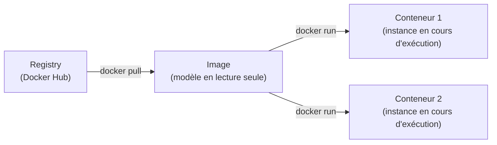
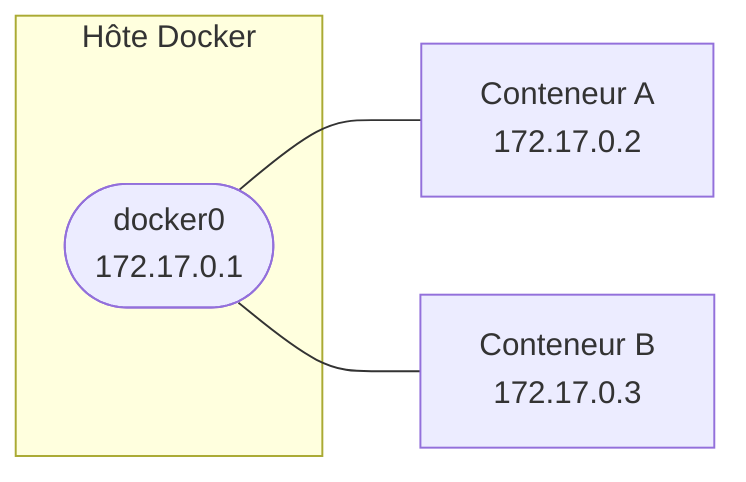

# Docker

## Prérequis

- Hôte Linux (testé sur Ubuntu Server, sans mode graphique), accès root ou sudo
- Notions de base d'administration Linux et de virtualisation
- Un client SSH avec copier/coller (MobaXterm ou équivalent) simplifie la saisie des commandes

---

## 1. Installation

Ajout du dépôt officiel Docker puis installation de l'édition Community :

```bash
sudo apt update
sudo apt install -y apt-transport-https ca-certificates curl software-properties-common

# Clé GPG et dépôt officiel Docker
curl -fsSL https://download.docker.com/linux/ubuntu/gpg \
  | sudo gpg --dearmor -o /usr/share/keyrings/docker-archive-keyring.gpg

echo "deb [arch=$(dpkg --print-architecture) \
  signed-by=/usr/share/keyrings/docker-archive-keyring.gpg] \
  https://download.docker.com/linux/ubuntu $(lsb_release -cs) stable" \
  | sudo tee /etc/apt/sources.list.d/docker.list > /dev/null

sudo apt update
apt-cache policy docker-ce    # confirme la version disponible avant installation
sudo apt install -y docker-ce

sudo systemctl enable --now docker
```

`apt-cache policy docker-ce` affiche la version qui sera installée — à vérifier avant de valider.  
`systemctl enable --now docker` active et démarre le service en une seule commande.

### Vérification post-installation

```bash
docker version          # versions du client et du démon
docker info             # état global : conteneurs, images, pilotes réseau et stockage
sudo docker run hello-world
```

### Droits sans sudo (optionnel)

Pour éviter de préfixer chaque commande par `sudo` :

```bash
sudo usermod -aG docker $USER
newgrp docker            # prend effet sans déconnexion
```

!!! warning "Risque de sécurité"
    Un utilisateur dans le groupe `docker` a des droits équivalents à `root` sur le système hôte. À ne faire que sur un poste de développement ou un environnement maîtrisé.

---

## 2. Concepts clés



| Terme | Définition |
|---|---|
| **Image** | Modèle immuable en couches ; sert de base à un ou plusieurs conteneurs |
| **Conteneur** | Instance en cours d'exécution d'une image ; isolé par namespace et cgroup |
| **Registry** | Dépôt d'images (Docker Hub par défaut, ou registre privé) |
| **Volume** | Stockage persistant découplé du cycle de vie du conteneur |
| **Réseau** | Couche d'isolation réseau entre conteneurs |

---

## 3. Images

### Rechercher et télécharger

```bash
docker search <terme>                       # liste les images disponibles sur Docker Hub
docker search <terme> --filter stars=50     # filtre par popularité minimum
docker search <terme> --limit 5             # limite le nombre de résultats

docker pull <image>                         # télécharge la dernière version (tag :latest)
docker pull <image>:<tag>                   # version précise, ex. ubuntu:22.04
docker pull <image> --platform linux/amd64  # force l'architecture cible
```

### Lister et inspecter

```bash
docker images                        # images locales (alias : docker image ls)
docker images -a                     # inclut les couches intermédiaires
docker images --format "table {{.Repository}}\t{{.Tag}}\t{{.Size}}"  # affichage personnalisé

docker inspect <image>               # configuration complète en JSON
docker inspect <image> --format '{{ .Config.Env }}'  # extrait un champ précis
docker history <image>               # couches qui composent l'image et leur taille
```

### Supprimer

```bash
docker rmi <image>                   # supprime l'image locale
docker rmi <image>:<tag>             # tag précis
docker image prune                   # supprime toutes les images non utilisées (dangling)
docker image prune -a                # supprime toutes les images sans conteneur associé
```

### Exporter / importer une image (sans registry)

```bash
docker tag <image> <image>:<tag>                     # attribue un tag avant export
docker save <image>:<tag> -o <archive>.tar           # export vers un fichier tar
docker load -i <archive>.tar                         # import depuis un fichier tar
```

`save`/`load` sont utiles pour transférer une image vers un hôte sans accès au dépôt d'origine.

---

## 4. Conteneurs — cycle de vie

### Lancer

```bash
docker run <image>                              # lance et arrête après exécution
docker run -d <image>                           # mode détaché (arrière-plan)
docker run -it <image> /bin/bash               # shell interactif
docker run --name <nom> <image>                 # nommer le conteneur
docker run --rm <image>                         # supprime automatiquement après arrêt
docker run -e VAR=valeur <image>                # variable d'environnement
docker run -e VAR=valeur --env-file .env <image>  # variables depuis un fichier

docker run -d \
  --name <nom> \
  --hostname <fqdn> \               # nom d'hôte interne du conteneur
  --restart unless-stopped \        # redémarre sauf si arrêté manuellement
  -p 8080:80 \                      # port hôte:port conteneur
  -v /chemin/hôte:/chemin/conteneur \
  -e CLE=valeur \
  <image>
```

| Politique `--restart` | Comportement |
|---|---|
| `no` (défaut) | Jamais redémarré |
| `on-failure[:n]` | Redémarre en cas d'erreur, `n` fois max |
| `always` | Toujours redémarré, même après `docker stop` |
| `unless-stopped` | Redémarre sauf si stoppé manuellement — **recommandé en production** |

### Interagir avec un conteneur en cours d'exécution

```bash
docker ps                           # conteneurs actifs
docker ps -a                        # tous les conteneurs, y compris arrêtés
docker ps --format "table {{.Names}}\t{{.Status}}\t{{.Ports}}"

docker exec -it <conteneur> /bin/bash   # ouvre un nouveau shell dans le conteneur
docker exec <conteneur> <commande>      # exécute une commande sans shell interactif
docker attach <conteneur>               # se rattache au processus principal du conteneur
```

!!! tip "Détacher sans arrêter"
    Dans un shell interactif (`-it`), ++ctrl+p++ puis ++ctrl+q++ détache la console sans arrêter le conteneur. `exit` en revanche ferme le shell **et** arrête le conteneur si aucun autre processus n't tourne.

### Arrêter, relancer, supprimer

```bash
docker stop <conteneur>             # envoie SIGTERM puis SIGKILL après 10 s
docker stop -t 30 <conteneur>       # délai personnalisé avant SIGKILL
docker kill <conteneur>             # SIGKILL immédiat
docker restart <conteneur>          # stop + start

docker start <conteneur>            # démarrer un conteneur arrêté
docker start -i <conteneur>         # avec shell interactif

docker pause <conteneur>            # suspend tous les processus (cgroup freeze)
docker unpause <conteneur>

docker rm <conteneur>               # supprime le conteneur (doit être arrêté)
docker rm -f <conteneur>            # force la suppression même si en cours d'exécution
docker container prune              # supprime tous les conteneurs arrêtés
```

!!! danger "Suppression en masse"
    ```bash
    docker rm -f $(docker ps -aq)
    ```
    Supprime **tous** les conteneurs de l'hôte sans distinction. À réserver aux tests volontaires.

### Inspecter et diagnostiquer

```bash
docker logs <conteneur>             # flux stdout/stderr du conteneur
docker logs -f <conteneur>          # suivi en temps réel (tail)
docker logs --tail 50 <conteneur>   # 50 dernières lignes
docker logs --since 1h <conteneur>  # depuis 1 heure

docker inspect <conteneur>          # configuration complète en JSON
docker inspect <conteneur> --format '{{ .State.Status }}'
docker stats                        # CPU, mémoire, I/O de tous les conteneurs en live
docker stats <conteneur>            # restreint à un conteneur
docker top <conteneur>              # processus en cours dans le conteneur
docker diff <conteneur>             # fichiers modifiés depuis le démarrage
docker port <conteneur>             # mappages de ports actifs
```

---

## 5. Réseau

### Architecture par défaut

À l'installation, Docker crée une interface `docker0` et un réseau bridge du même nom. Sans précision au lancement, tout conteneur y est rattaché.



### Commandes réseau

```bash
docker network ls                           # liste tous les réseaux
docker network inspect <réseau>             # détails : sous-réseau, conteneurs rattachés
docker network create <réseau>              # crée un réseau bridge personnalisé
docker network create --driver bridge \
  --subnet 192.168.100.0/24 \
  --gateway 192.168.100.1 <réseau>          # avec paramètres explicites
docker network rm <réseau>                  # supprime un réseau (doit être vide)
docker network prune                        # supprime tous les réseaux inutilisés

docker network connect <réseau> <conteneur>     # rattache un conteneur à un réseau
docker network disconnect <réseau> <conteneur>  # détache
```

!!! tip "Préférer un réseau bridge personnalisé"
    Sur le réseau `bridge` par défaut, les conteneurs se joignent par IP. Sur un bridge **nommé**, Docker active un DNS interne : les conteneurs se joignent directement par leur nom (`--name`).

### Modifier le réseau docker0

Si `172.17.0.0/16` entre en conflit avec un plan d'adressage existant, créer ou modifier `/etc/docker/daemon.json` :

```json
{
  "bip": "<adresse-ip>/24"
}
```

```bash
sudo systemctl daemon-reload
sudo service docker restart
ip a show docker0
```

!!! warning "Coupure de connectivité lors du redémarrage"
    `service docker restart` interrompt brièvement `docker0` et coupe la mise en réseau de tous les conteneurs en cours d'exécution pendant que le démon redémarre. Les conteneurs ne s'arrêtent pas, mais leurs connexions réseau (Portainer inclus) se rétablissent seulement une fois le service revenu.

??? note "Revenir à la valeur par défaut"
    Repasser `bip` à sa valeur d'origine, redémarrer, vérifier, puis supprimer le fichier :
    ```json
    {
      "bip": "172.17.0.1/16"
    }
    ```
    ```bash
    sudo systemctl daemon-reload
    sudo service docker restart
    sudo rm -f /etc/docker/daemon.json
    ```

---

## 6. Volumes et persistance

Les données écrites dans un conteneur disparaissent à sa suppression. Les volumes permettent de les persister.

### Types de montage

| Type | Syntaxe | Cas d'usage |
|---|---|---|
| **Volume nommé** | `-v nom_volume:/chemin` | Données persistantes gérées par Docker |
| **Bind mount** | `-v /chemin/hôte:/chemin/conteneur` | Partage de fichiers de l'hôte |
| **tmpfs** | `--tmpfs /chemin` | Données temporaires en RAM |

### Volumes nommés

```bash
docker volume create <volume>               # crée un volume
docker volume ls                            # liste les volumes
docker volume inspect <volume>              # emplacement sur l'hôte, métadonnées
docker volume rm <volume>                   # supprime un volume
docker volume prune                         # supprime les volumes non utilisés
```

### Bind mounts

```bash
# Lecture/écriture (défaut)
docker run -it --name <conteneur> \
  -v /chemin/hôte:/chemin/conteneur \
  <image>

# Lecture seule
docker run -it --name <conteneur> \
  -v /chemin/hôte:/chemin/conteneur:ro \
  <image>
```

`:ro` monte le partage en lecture seule — toute tentative d'écriture depuis le conteneur échoue.

---

## 7. Dockerfile — construire ses propres images

Un `Dockerfile` décrit les instructions pour assembler une image personnalisée.

### Structure type

```dockerfile
# Image de base
FROM ubuntu:22.04

# Métadonnées
LABEL maintainer="nom@exemple.fr"
LABEL version="1.0"

# Variables disponibles à la construction
ARG DEBIAN_FRONTEND=noninteractive

# Variables d'environnement dans le conteneur
ENV APP_HOME=/app \
    APP_PORT=8080

# Installation de dépendances (une seule couche RUN pour limiter la taille)
RUN apt-get update && apt-get install -y \
    curl \
    nginx \
    && rm -rf /var/lib/apt/lists/*

# Répertoire de travail
WORKDIR $APP_HOME

# Copie des fichiers sources
COPY . .

# Exposition du port (documentation, pas de publication automatique)
EXPOSE $APP_PORT

# Commande lancée au démarrage du conteneur
CMD ["nginx", "-g", "daemon off;"]
```

### Construction

```bash
docker build -t <image>:<tag> .                   # construit depuis le répertoire courant
docker build -t <image>:<tag> -f <Dockerfile> .   # Dockerfile à un chemin précis
docker build --no-cache -t <image>:<tag> .         # ignore le cache (utile après mise à jour)
docker build --build-arg VAR=valeur -t <image> .   # passe une variable ARG
```

### Bonnes pratiques

- Regrouper les `RUN apt install` en une seule instruction pour réduire le nombre de couches
- Nettoyer le cache APT dans le même `RUN` : `&& rm -rf /var/lib/apt/lists/*`
- Utiliser `.dockerignore` pour exclure les fichiers inutiles du contexte de build
- Préférer les images officielles et les tags versionnés plutôt que `:latest`

---

## 8. Docker Compose

Docker Compose orchestre plusieurs conteneurs décrits dans un fichier `compose.yml`.

### Structure type

```yaml
services:
  web:
    image: nginx:1.25
    container_name: web
    restart: unless-stopped
    ports:
      - "80:80"
      - "443:443"
    volumes:
      - ./html:/usr/share/nginx/html:ro
      - ./conf/nginx.conf:/etc/nginx/nginx.conf:ro
    networks:
      - frontend
    depends_on:
      - db
    environment:
      - TZ=Europe/Paris

  db:
    image: mariadb:10.11
    container_name: db
    restart: unless-stopped
    volumes:
      - db_data:/var/lib/mysql
    networks:
      - frontend
    environment:
      MARIADB_ROOT_PASSWORD: ${DB_ROOT_PASSWORD}
      MARIADB_DATABASE: ${DB_NAME}
      MARIADB_USER: ${DB_USER}
      MARIADB_PASSWORD: ${DB_PASSWORD}

volumes:
  db_data:

networks:
  frontend:
    driver: bridge
```

!!! tip "Variables sensibles dans un fichier `.env`"
    Placer les mots de passe et clés dans un fichier `.env` à la racine du projet (exclu du dépôt via `.gitignore`). Compose le charge automatiquement.

### Commandes Compose

```bash
docker compose up -d                    # démarre tous les services en arrière-plan
docker compose up -d --build            # reconstruit les images avant de démarrer
docker compose up -d <service>          # démarre un seul service

docker compose down                     # arrête et supprime les conteneurs + réseaux
docker compose down -v                  # supprime aussi les volumes nommés
docker compose down --rmi all           # supprime aussi les images

docker compose ps                       # état des services
docker compose logs -f                  # suivi des logs de tous les services
docker compose logs -f <service>        # restreint à un service

docker compose exec <service> /bin/bash # shell dans un conteneur du projet
docker compose restart <service>        # redémarre un service

docker compose pull                     # télécharge les images les plus récentes
docker compose config                   # valide et affiche la configuration résolue
```

---

## 9. Interface graphique : Portainer

Portainer expose une interface web complète pour gérer les conteneurs, images, volumes et réseaux.

```bash
docker volume create portainer_data

docker run -d \
  --name portainer \
  --restart unless-stopped \
  -p 9000:9000 \
  -v /var/run/docker.sock:/var/run/docker.sock \
  -v portainer_data:/data \
  portainer/portainer-ce:latest
```

Accès depuis un navigateur : `http://<adresse-ip-serveur>:9000`  
Le mot de passe administrateur est défini au premier lancement.

!!! note "Portainer via Compose"
    Portainer s'intègre naturellement dans un `compose.yml` aux côtés des autres services, ce qui facilite sa mise à jour et sa gestion.

---

## 10. Enregistrer un conteneur modifié

Après avoir modifié un conteneur manuellement (installation de paquets, configuration…), il est possible de figer son état dans une nouvelle image :

```bash
docker commit <conteneur> <nouvelle-image>
docker commit -m "Description du changement" -a "Auteur" <conteneur> <nouvelle-image>:<tag>
```

!!! note "Nom d'image en minuscules"
    `docker commit` refuse un nom d'image contenant des majuscules.

Préférer un `Dockerfile` pour toute image destinée à être reproductible ou partagée — `commit` convient surtout aux tests et snapshots ponctuels.

---

## 11. Maintenance et nettoyage

### Nettoyage ciblé

```bash
docker container prune          # conteneurs arrêtés
docker image prune              # images dangling (sans tag ni conteneur associé)
docker image prune -a           # toutes les images non utilisées
docker volume prune             # volumes non rattachés à un conteneur
docker network prune            # réseaux inutilisés
```

### Nettoyage global

```bash
docker system df                # espace occupé par images, conteneurs, volumes
docker system prune             # supprime conteneurs arrêtés + images dangling + réseaux inutilisés
docker system prune -a          # inclut toutes les images non utilisées
docker system prune -a --volumes  # inclut aussi les volumes
```

!!! danger "Irréversible"
    `docker system prune -a --volumes` supprime toutes les données non actives sans confirmation individuelle. À n'utiliser que sur un environnement que l'on est prêt à reconstruire entièrement.

### Désinstallation complète

```bash
docker rm -f $(docker ps -aq)
docker rmi -f $(docker images -q)
docker volume prune -f
sudo apt purge -y docker-ce docker-ce-cli containerd.io docker-buildx-plugin docker-compose-plugin
sudo rm -rf /var/lib/docker /etc/docker
```

!!! danger "Destruction totale"
    Cette séquence supprime **tout** Docker et ses données sur l'hôte. À réserver à une désinstallation complète décidée délibérément, jamais à un retour arrière partiel.

---

## Vérification

```bash
docker version
docker info
docker ps -a
docker images
docker network ls
docker volume ls
docker system df
```

---

## Dépannage

| Symptôme | Cause probable | Résolution |
|---|---|---|
| `/etc/docker/daemon.json` introuvable | Fichier absent par défaut | Le créer avec le contenu attendu, puis `systemctl daemon-reload` et `service docker restart` |
| Changement de `bip` sans effet sur `docker0` | Service non rechargé après modification | `systemctl daemon-reload` puis `service docker restart`, vérifier avec `ip a show docker0` |
| `docker commit` refusé | Nom d'image contenant une majuscule | Reprendre le nom entièrement en minuscules |
| Écriture refusée dans un volume monté | Montage en lecture seule (`:ro`) | Comportement attendu ; remonter sans `:ro` si l'écriture est nécessaire |
| Le conteneur s'arrête en quittant le shell | Sortie avec `exit` plutôt qu'un détachement | Utiliser ++ctrl+p++ ++ctrl+q++ pour se détacher sans arrêter le conteneur |
| Tous les conteneurs ont disparu | `docker rm $(docker ps -aq)` exécuté sans filtrage | Éviter cette commande telle quelle ; cibler des conteneurs précis ou filtrer avant suppression |
| `permission denied` sur `/var/run/docker.sock` | Utilisateur non dans le groupe `docker` | `sudo usermod -aG docker $USER` puis `newgrp docker` |
| Image introuvable après `docker build` | Tag oublié ou mauvais contexte de build | Vérifier le chemin passé à `docker build` et que le `Dockerfile` est présent |
| Les conteneurs d'un Compose ne se joignent pas par nom | Réseau non déclaré dans `compose.yml` | Déclarer un réseau commun dans la section `networks:` de chaque service |
