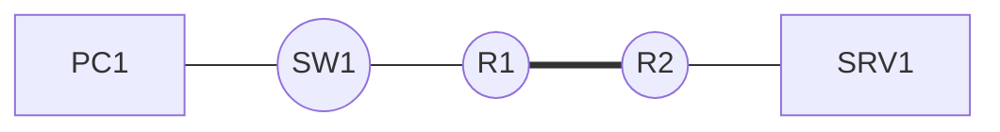

# Page template

Copy the block below to start a new procedure.

````markdown
# Procedure title

## Context

What the procedure achieves, and in which situation it applies.

## Prerequisites

- Hardware and software versions
- Required access and rights
- Configuration assumed already in place

## Topology



## Procedure

### 1. First step

```cisco
command
```

### 2. Second step

```cisco
command
```

## Rollback plan

How to undo this configuration if it needs to be removed.

```cisco
undo command
```

## Verification

```cisco
show ...
```

Expected result: describe what should appear.

## Troubleshooting

| Symptom | Likely cause | Fix |
|---|---|---|
| | | |
````
