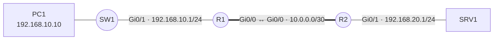

# Gabarit de fiche

Copier le bloc ci-dessous pour créer une nouvelle procédure. La structure est identique sur toutes les fiches du site — chaque section a un rôle précis.

---

## Rôle de chaque section

| Section | Contenu attendu |
|---|---|
| **Contexte** | Ce que la procédure permet de faire et dans quelle situation on l'applique |
| **Prérequis** | Matériel, versions, accès, configuration supposée déjà en place |
| **Topologie** | Diagramme Mermaid du scénario, avec adresses et noms d'interfaces |
| **Procédure** | Étapes numérotées, une opération par `###`, commandes dans des blocs de code |
| **Plan de retour arrière** | Comment défaire ce qui a été fait, dans le bon ordre |
| **Vérification** | Commande(s) qui prouvent que ça fonctionne + résultat attendu |
| **Dépannage** | Tableau symptôme → cause probable → correction |

---

## Gabarit à copier

````markdown
# Titre de la procédure

## Contexte

Ce que la procédure permet de faire, et dans quelle situation on l'applique.

## Prérequis

- Matériel et versions logicielles nécessaires
- Accès et droits requis (root, mode privilégié, SSH…)
- Configuration supposée déjà en place (lien vers une autre fiche si besoin)

## Topologie



## Procédure

### 1. Première étape

Description courte de ce que fait cette étape.

```cisco
commande
```

!!! tip "Indication utile"
    Explication d'un comportement non évident ou d'une option importante.

### 2. Deuxième étape

```cisco
commande
```

### 3. Enregistrer

```cisco
end
copy running-config startup-config
```

## Plan de retour arrière

Comment annuler cette configuration, dans quel ordre, et ce qu'il ne faut pas oublier.

```cisco
configure terminal
no <commande-à-annuler>
end
copy running-config startup-config
```

!!! warning "Dépendances à vérifier avant de retirer"
    Indiquer si d'autres configurations (ACL, NAT, autre protocole) dépendent de ce qui est retiré.

## Vérification

```cisco
show ...
```

Résultat attendu : décrire ce qui doit apparaître pour confirmer que la procédure a fonctionné.

## Dépannage

| Symptôme | Cause probable | Correction |
|---|---|---|
| Symptôme 1 | Cause 1 | Correction 1 |
| Symptôme 2 | Cause 2 | Correction 2 |
````

---

## Conventions de rédaction

Les [conventions d'écriture](conventions.md) détaillent les notations utilisées sur tout le site (adresses de référence, noms d'interfaces, valeurs génériques). À lire avant de créer une nouvelle fiche.

### Blocs de code

- `cisco` — commandes Cisco IOS
- `bash` — shell Linux
- `powershell` — PowerShell Windows
- `yaml` — fichiers de configuration YAML
- `json` — fichiers JSON
- `text` — configuration en texte libre (sudoers, etc.)

### Admonitions disponibles

```markdown
!!! note "Titre"        → information neutre
!!! tip "Titre"         → conseil pratique, bonne pratique
!!! warning "Titre"     → point d'attention, risque de coupure
!!! danger "Titre"      → action irréversible ou destructrice
??? note "Titre"        → note repliée (même types disponibles)
```
