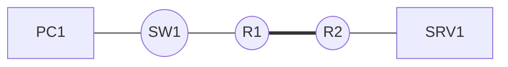

# Gabarit de fiche

Copier le bloc ci-dessous pour créer une nouvelle procédure.

````markdown
# Titre de la procédure

## Contexte

Ce que la procédure permet de faire, et dans quelle situation on l'applique.

## Prérequis

- Matériel et versions logicielles
- Accès et droits nécessaires
- Configuration supposée déjà en place

## Topologie



## Procédure

### 1. Première étape

```cisco
commande
```

### 2. Deuxième étape

```cisco
commande
```

## Vérification

```cisco
show ...
```

Résultat attendu : décrire ce qui doit apparaître.

## Dépannage

| Symptôme | Cause probable | Correction |
|---|---|---|
| | | |
````
