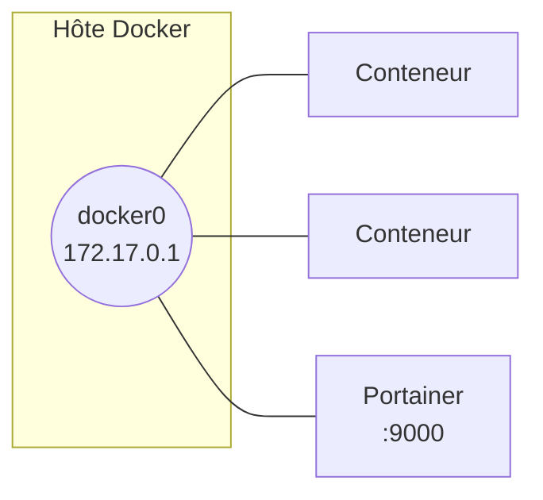

# Docker

## Prérequis

- Hôte Linux (testé sur Ubuntu Server, sans mode graphique), accès root ou sudo
- Notions de base d'administration Linux et de virtualisation
- Un client SSH avec copier/coller (MobaXterm ou équivalent) simplifie la saisie des commandes

## Installation

```bash
apt install apt-transport-https ca-certificates curl software-properties-common
curl -fsSL https://download.docker.com/linux/ubuntu/gpg | sudo gpg --dearmor -o /usr/share/keyrings/docker-archive-keyring.gpg
echo "deb [arch=$(dpkg --print-architecture) signed-by=/usr/share/keyrings/docker-archive-keyring.gpg] https://download.docker.com/linux/ubuntu $(lsb_release -cs) stable" | sudo tee /etc/apt/sources.list.d/docker.list > /dev/null
apt update
apt-cache policy docker-ce
apt install docker-ce
systemctl enable docker
```

`apt-cache policy docker-ce` confirme la version qui sera installée avant de valider. `systemctl enable docker` assure le démarrage automatique du service au boot.

## Réseau par défaut

À l'installation, Docker crée une interface `docker0` et un réseau bridge du même nom. Sans précision au lancement, tout conteneur y est rattaché et peut joindre les autres conteneurs de ce réseau.



```bash
ip a show docker0
```

Si `172.17.0.0/16` entre en conflit avec un plan d'adressage existant, le fichier `/etc/docker/daemon.json` (absent par défaut) permet de le changer :

```bash
sudo nano /etc/docker/daemon.json
```

```json
{
  "bip": "<adresse-ip>/24"
}
```

```bash
systemctl daemon-reload
service docker restart
ip a show docker0
```

!!! warning "Revenir en arrière"
    Supprimer directement le fichier ne suffit pas toujours. Repasser d'abord `bip` à sa valeur par défaut, redémarrer, vérifier, puis seulement supprimer le fichier :

    ```json
    {
      "bip": "172.17.0.1/16"
    }
    ```

    ```bash
    systemctl daemon-reload
    service docker restart
    rm -f /etc/docker/daemon.json
    ```

## Interface graphique : Portainer

Toute la gestion Docker est possible en ligne de commande ; Portainer ajoute une interface web équivalente.

```bash
docker pull portainer/portainer-ce
docker images
docker run -d -p 9000:9000 --name portainer --restart always \
  -v /var/run/docker.sock:/var/run/docker.sock \
  -v portainer_data:/data \
  portainer/portainer-ce
docker ps
```

Accès ensuite depuis un navigateur du poste hôte : `http://<adresse-ip-du-serveur>:9000`. Le mot de passe administrateur se définit au premier lancement de l'interface.

## Images

```bash
docker search <terme>
docker pull <image>
docker images
docker inspect <image>
docker info
```

`docker inspect` détaille la configuration de l'image ; `docker info` indique notamment l'emplacement de stockage des images et conteneurs sur l'hôte.

## Conteneurs — cycle de vie

```bash
docker run <image> <commande>                 # exécute la commande puis arrête le conteneur
docker ps                                      # conteneurs en cours d'exécution
docker ps -a                                   # tous les conteneurs, y compris arrêtés
docker run --name <conteneur> <image> <commande>
docker logs <conteneur>
docker rm <conteneur>                          # ou : docker rm <id>
```

```bash
docker run --name <conteneur> -i -t <image>    # shell interactif dans un nouveau conteneur
```

Pour sortir sans arrêter le conteneur : ++ctrl+p++ puis ++ctrl+q++ (détache la console). `exit` en revanche ferme le shell **et** arrête le conteneur s'il n'a pas d'autre processus actif.

```bash
docker start <conteneur>                       # redémarrer sans shell interactif
docker start -i <conteneur>                    # redémarrer avec shell interactif
docker stop <conteneur>
docker attach <conteneur>                      # rouvrir une console sur un conteneur actif
docker exec -it <conteneur> /bin/bash          # ou : ouvrir un nouveau shell dans le conteneur
docker pause <conteneur>                       # suspendre tous les processus du conteneur
docker unpause <conteneur>
```

!!! danger "Ne pas exécuter en dehors d'un test volontaire"
    ```bash
    docker rm $(docker ps -aq)
    ```
    Supprime tous les conteneurs de l'hôte, sans distinction — y compris ceux d'une interface comme Portainer.

## Partager un répertoire de l'hôte avec un conteneur

```bash
mkdir <répertoire-hôte>
chmod 777 <répertoire-hôte>
docker run -it --name <conteneur> -v <répertoire-hôte>:<répertoire-conteneur> <image>
```

Le conteneur a accès en lecture/écriture au répertoire de l'hôte à travers le point de montage indiqué. Un fichier créé d'un côté apparaît immédiatement de l'autre.

```bash
docker run -it --name <conteneur> -v <répertoire-hôte>:<répertoire-conteneur>:ro <image>
```

Le suffixe `:ro` monte le partage en lecture seule — toute tentative d'écriture depuis ce conteneur échoue.

## Enregistrer un conteneur modifié dans une nouvelle image

```bash
docker commit <conteneur> <nouvelle-image>
```

!!! note "Le nom de l'image doit être en minuscules"
    `docker commit` refuse un nom d'image contenant des majuscules.

```bash
docker tag <nouvelle-image> <nouvelle-image>:<tag>
docker save <nouvelle-image>:<tag> > <chemin-archive>.tar
docker rmi <nouvelle-image>:<tag>
docker load < <chemin-archive>.tar
```

`save`/`load` exportent et réimportent une image sous forme d'archive `.tar`, utile pour la transférer vers un hôte sans accès au dépôt d'origine.

## Vérification

```bash
docker ps -a
docker images
docker network ls
docker network inspect bridge
docker volume ls
```

## Dépannage

| Symptôme | Cause probable | Résolution |
|---|---|---|
| `/etc/docker/daemon.json` introuvable | Fichier absent par défaut, à créer soi-même | Le créer avec le contenu attendu, puis `systemctl daemon-reload` et `service docker restart` |
| Changement de `bip` sans effet sur `docker0` | Service non rechargé après modification | `systemctl daemon-reload` puis `service docker restart`, vérifier avec `ip a show docker0` |
| `docker commit` refusé | Nom d'image contenant une majuscule | Reprendre le nom entièrement en minuscules |
| Écriture refusée dans un volume monté | Montage en lecture seule (`:ro`) | Comportement attendu ; remonter sans `:ro` si l'écriture est nécessaire |
| Le conteneur s'arrête en quittant le shell | Sortie avec `exit` plutôt qu'un détachement | Utiliser ++ctrl+p++ ++ctrl+q++ pour se détacher sans arrêter le conteneur |
| Tous les conteneurs ont disparu | `docker rm $(docker ps -aq)` exécuté sans filtrage | Éviter cette commande telle quelle ; cibler des conteneurs précis ou filtrer avant suppression |
