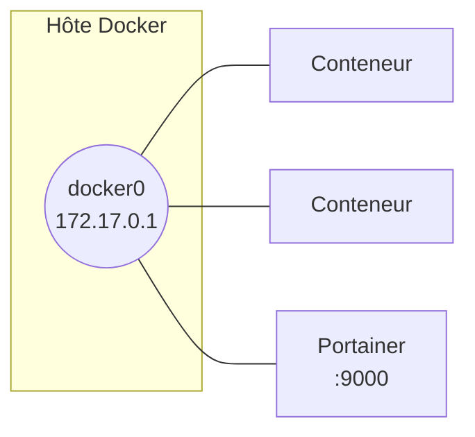

# Docker

## Contexte

Docker exécute des applications dans des conteneurs isolés, à partir d'images, sans la surcharge d'une machine virtuelle complète. Cette fiche couvre l'installation sur Ubuntu Server, le réseau créé par défaut, la gestion des images et des conteneurs, le partage de fichiers avec l'hôte, et la sauvegarde d'une image modifiée.

## Prérequis

- VM Ubuntu Server (testé sans mode graphique), accès root ou sudo
- Notions de base d'administration Linux et de virtualisation
- Un client SSH avec copier/coller (MobaXterm ou équivalent) simplifie la saisie des commandes

## Réseau créé par Docker

À l'installation, Docker crée une interface `docker0` et un réseau bridge du même nom. Sans précision au lancement, tout conteneur y est rattaché et peut joindre les autres conteneurs de ce réseau.



## Procédure

### 1. Installer Docker

```bash
apt install apt-transport-https ca-certificates curl software-properties-common
curl -fsSL https://download.docker.com/linux/ubuntu/gpg | sudo gpg --dearmor -o /usr/share/keyrings/docker-archive-keyring.gpg
echo "deb [arch=$(dpkg --print-architecture) signed-by=/usr/share/keyrings/docker-archive-keyring.gpg] https://download.docker.com/linux/ubuntu $(lsb_release -cs) stable" | sudo tee /etc/apt/sources.list.d/docker.list > /dev/null
apt update
apt-cache policy docker-ce
apt install docker-ce
systemctl enable docker
```

`apt-cache policy docker-ce` confirme la version qui sera installée avant de valider. `systemctl enable docker` assure le démarrage automatique du service au boot.

### 2. Personnaliser le réseau par défaut

Si `172.17.0.0/16` entre en conflit avec le plan d'adressage existant, le fichier `/etc/docker/daemon.json` (absent par défaut) permet de le changer :

```bash
sudo nano /etc/docker/daemon.json
```

```json
{
  "bip": "192.168.20.1/24"
}
```

```bash
systemctl daemon-reload
service docker restart
ip a show docker0
```

!!! warning "Revenir en arrière"
    Supprimer directement le fichier ne suffit pas toujours. Repasser d'abord `bip` à sa valeur par défaut, redémarrer, vérifier, puis seulement supprimer le fichier :

    ```json
    {
      "bip": "172.17.0.1/16"
    }
    ```

    ```bash
    systemctl daemon-reload
    service docker restart
    rm -f /etc/docker/daemon.json
    ```

### 3. Interface graphique : Portainer

Toute la gestion Docker est possible en ligne de commande ; Portainer ajoute une interface web équivalente.

```bash
docker pull portainer/portainer-ce
docker images
docker run -d -p 9000:9000 --name portainer --restart always \
  -v /var/run/docker.sock:/var/run/docker.sock \
  -v portainer_data:/data \
  portainer/portainer-ce
docker ps
```

Accès ensuite depuis un navigateur du poste hôte : `http://<adresse-ip-du-serveur>:9000`. Le mot de passe administrateur se définit au premier lancement de l'interface.

### 4. Chercher, télécharger et inspecter une image

```bash
docker search ubuntu
docker pull ubuntu
docker images
docker inspect ubuntu
docker info
```

`docker inspect` détaille la configuration de l'image ; `docker info` indique notamment l'emplacement de stockage des images et conteneurs sur l'hôte.

### 5. Cycle de vie d'un conteneur

```bash
docker run ubuntu cat /etc/issue
```

Lance le conteneur, exécute la commande, puis l'arrête — le conteneur n'a pas vocation à rester actif au-delà de cette commande.

```bash
docker ps                                    # conteneurs en cours d'exécution
docker ps -a                                 # tous les conteneurs, y compris arrêtés
docker run --name ubuntu_issue ubuntu cat /etc/issue
docker logs ubuntu_issue
docker rm ubuntu_issue                       # ou : docker rm <ID>
```

```bash
docker run --name shell_ubuntu -i -t ubuntu   # shell interactif dans un nouveau conteneur
```

Pour sortir sans arrêter le conteneur : ++ctrl+p++ puis ++ctrl+q++ (détache la console). `exit` en revanche ferme le shell **et** arrête le conteneur s'il n'a pas d'autre processus actif.

```bash
docker start shell_ubuntu                     # redémarrer sans shell interactif
docker start -i shell_ubuntu                  # redémarrer avec shell interactif
docker stop shell_ubuntu
docker attach shell_ubuntu                    # rouvrir une console sur un conteneur actif
docker exec -it shell_ubuntu /bin/bash        # ou : ouvrir un nouveau shell dans le conteneur
docker pause shell_ubuntu                     # suspendre tous les processus du conteneur
docker unpause shell_ubuntu
```

!!! danger "Ne pas exécuter en dehors d'un test volontaire"
    ```bash
    docker rm $(docker ps -aq)
    ```
    Supprime tous les conteneurs de l'hôte, y compris ceux qui ne devraient pas l'être (Portainer par exemple).

### 6. Partager un répertoire de l'hôte avec un conteneur

```bash
cd /home
mkdir partage
chmod 777 partage
```

```bash
docker run -it --name part_rw_ubuntu -v /home/partage:/home/PartageDocker ubuntu
```

Le conteneur a accès en lecture/écriture à `/home/partage` de l'hôte à travers `/home/PartageDocker`. Un dossier créé d'un côté apparaît immédiatement de l'autre.

```bash
docker run -it --name part_ro_ubuntu -v /home/partage:/home/PartageDocker:ro ubuntu
```

Le suffixe `:ro` monte le partage en lecture seule — toute tentative d'écriture depuis ce conteneur échoue.

### 7. Enregistrer un conteneur modifié dans une nouvelle image

```bash
docker commit part_ro_ubuntu part_ro_ubuntuv1
```

!!! note "Le nom de l'image doit être en minuscules"
    `docker commit` refuse un nom d'image contenant des majuscules.

```bash
docker tag part_ro_ubuntuv1 part_ro_ubuntuv1:updated16122019
docker save part_ro_ubuntuv1:updated16122019 > /root/part_ro_ubuntuv1_sauv.tar
docker rmi part_ro_ubuntuv1:updated16122019
docker load < /root/part_ro_ubuntuv1_sauv.tar
```

`save`/`load` exportent et réimportent une image sous forme d'archive `.tar`, utile pour la transférer vers un hôte sans accès au dépôt d'origine.

## Vérification

```bash
docker ps -a
docker images
docker network ls
docker network inspect bridge
docker volume ls
```

## Dépannage

| Symptôme | Cause probable | Résolution |
|---|---|---|
| `/etc/docker/daemon.json` introuvable | Fichier absent par défaut, à créer soi-même | Le créer avec le contenu attendu, puis `systemctl daemon-reload` et `service docker restart` |
| Changement de `bip` sans effet sur `docker0` | Service non rechargé après modification | `systemctl daemon-reload` puis `service docker restart`, vérifier avec `ip a show docker0` |
| `docker commit` refusé | Nom d'image contenant une majuscule | Reprendre le nom entièrement en minuscules |
| Écriture refusée dans un volume monté | Montage en lecture seule (`:ro`) | Comportement attendu ; remonter sans `:ro` si l'écriture est nécessaire |
| Le conteneur s'arrête en quittant le shell | Sortie avec `exit` plutôt qu'un détachement | Utiliser ++ctrl+p++ ++ctrl+q++ pour se détacher sans arrêter le conteneur |
| Tous les conteneurs ont disparu, Portainer inclus | `docker rm $(docker ps -aq)` exécuté sans filtrage | Éviter cette commande telle quelle ; cibler des conteneurs précis ou filtrer avant suppression |
