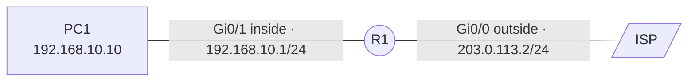

# NAT and PAT

## Context

Letting a private network reach the outside behind a single public address (PAT), and exposing an internal server to the outside (static NAT or port forwarding).

## Prerequisites

- An edge router with a LAN-side interface and a WAN-side interface
- Routing already working internally — see [Static routing](routage-statique.md)
- A default route toward the ISP

## Topology



## Procedure

### 1. Mark the interfaces

The router needs to know which side holds the network to be translated.

```cisco
enable
configure terminal
interface GigabitEthernet0/1
 ip nat inside
exit
interface GigabitEthernet0/0
 ip nat outside
exit
```

!!! warning "The most common mistake"
    A NAT that translates nothing almost always comes down to a forgotten `ip nat inside` or `ip nat outside`. `show ip nat statistics` lists the interfaces it picked up: if that list is empty, that's where to look.

### 2. Define the traffic to translate

```cisco
access-list 1 permit 192.168.10.0 0.0.0.255
```

The ACL uses a wildcard mask, the inverse of a subnet mask: `/24` is written `0.0.0.255`.

### 3. Enable PAT

Every machine on the LAN goes out behind the WAN interface's address, told apart by source port.

```cisco
ip nat inside source list 1 interface GigabitEthernet0/0 overload
```

The `overload` keyword is what sets PAT apart from dynamic NAT. Without it, you'd need as many public addresses as simultaneous machines.

### 4. Variant: dynamic NAT with a pool

Used when several public addresses are available.

```cisco
ip nat pool PUBLIC 203.0.113.20 203.0.113.30 netmask 255.255.255.0
ip nat inside source list 1 pool PUBLIC overload
```

### 5. Expose an internal server

=== "Static NAT (whole address)"

    ```cisco
    ip nat inside source static 192.168.20.10 203.0.113.10
    ```

    The server is reachable on all its ports from outside. Reserve this for cases where it's genuinely needed.

=== "Port forwarding (a single service)"

    ```cisco
    ip nat inside source static tcp 192.168.20.10 443 203.0.113.2 443 extendable
    ```

    Only port 443 is published, on the address already used for PAT. This is the form to favor: it reduces the exposed surface.

### 6. Save

```cisco
end
write memory
```

## Linux equivalent

=== "nftables"

    ```bash
    sysctl -w net.ipv4.ip_forward=1
    nft add table ip nat
    nft 'add chain ip nat postrouting { type nat hook postrouting priority 100 ; }'
    nft add rule ip nat postrouting oifname "ens18" masquerade
    ```

=== "iptables"

    ```bash
    sysctl -w net.ipv4.ip_forward=1
    iptables -t nat -A POSTROUTING -o ens18 -s 192.168.10.0/24 -j MASQUERADE
    ```

!!! note "Making IP forwarding persistent"
    `sysctl -w` doesn't survive a reboot. Write `net.ipv4.ip_forward=1` to `/etc/sysctl.d/99-router.conf`, then `sysctl --system`.

## Rollback plan

=== "Cisco IOS"

    ```cisco
    configure terminal
    no ip nat inside source list 1 interface GigabitEthernet0/0 overload
    no ip nat inside source static tcp 192.168.20.10 443 203.0.113.2 443 extendable
    no access-list 1
    interface GigabitEthernet0/1
     no ip nat inside
    exit
    interface GigabitEthernet0/0
     no ip nat outside
    exit
    end
    write memory
    ```

    Remove the translation rules first, then the ACL, then the interface markings — in that order, so an interface is never left marked `nat inside`/`outside` with no rule attached. Translations already in progress stay active until they expire; to cut them immediately:

    ```cisco
    clear ip nat translation *
    ```

=== "Linux (nftables)"

    ```bash
    nft delete table ip nat
    ```

    Removes the entire table — so every NAT rule it held, not just the one added here. On a firewall where other NAT rules coexist, remove only the rule concerned with `nft delete rule` and its handle (`nft -a list table ip nat` to get it).

=== "Linux (iptables)"

    ```bash
    iptables -t nat -D POSTROUTING -o ens18 -s 192.168.10.0/24 -j MASQUERADE
    ```

    `-D` removes exactly the rule that was added, reusing the same parameters used to add it with `-A`.

!!! warning "Outbound traffic stops immediately"
    Without NAT/PAT, LAN machines can no longer reach the outside with a private address. Warn the users concerned before removing this configuration outside a maintenance window.

## Verification

```cisco
show ip nat translations
show ip nat statistics
```

The table should fill up as soon as a LAN host generates outbound traffic. Each entry shows the inside local address, the inside global address, and the destination. Under PAT, source ports appear after the address: `192.168.10.10:1234`.

To watch translations live on a lab setup:

```cisco
debug ip nat
undebug all
```

!!! danger "`debug` in production"
    `debug ip nat` prints a line per translated packet and can saturate the CPU of a busy router. Reserve it for test environments, and always follow it with `undebug all`.

## Troubleshooting

| Symptom | Likely cause | Fix |
|---|---|---|
| `show ip nat translations` stays empty | Missing `ip nat inside`/`outside` | Check with `show ip nat statistics` |
| Translation created but no reply | Default route missing | `ip route 0.0.0.0 0.0.0.0 <gateway>` |
| LAN gets out, but the published server stays unreachable | Forwarding to the wrong port, or a blocking inbound ACL | Check the static rule, then `show access-lists` |
| Old translation persists after a change | Cached entries | `clear ip nat translation *` |
| Only one host can get out at a time | `overload` forgotten | Redo step 3 |
