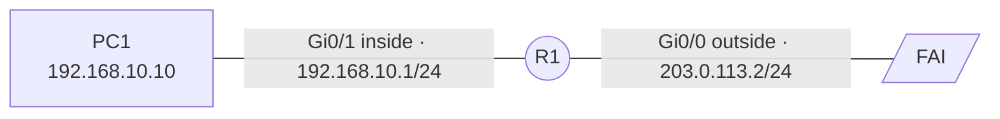

# NAT et PAT

## Contexte

Permettre à un réseau privé d'atteindre l'extérieur derrière une seule adresse publique (PAT), et exposer un serveur interne depuis l'extérieur (NAT statique ou redirection de port).

## Prérequis

- Un routeur de bordure avec une interface côté LAN et une interface côté WAN
- Le routage déjà fonctionnel en interne — voir [Routage statique](routage-statique.md)
- Une route par défaut vers le fournisseur d'accès

## Topologie



## Procédure

### 1. Marquer les interfaces

Le routeur doit savoir de quel côté se trouve le réseau à traduire.

```cisco
enable
configure terminal
interface GigabitEthernet0/1
 ip nat inside
exit
interface GigabitEthernet0/0
 ip nat outside
exit
```

!!! warning "L'erreur la plus fréquente"
    Un NAT qui ne traduit rien vient presque toujours d'un `ip nat inside` ou `ip nat outside` oublié. `show ip nat statistics` affiche les interfaces retenues : si la liste est vide, c'est là qu'il faut regarder.

### 2. Définir le trafic à traduire

```cisco
access-list 1 permit 192.168.10.0 0.0.0.255
```

L'ACL utilise un masque générique (wildcard), inverse du masque de sous-réseau : `/24` s'écrit `0.0.0.255`.

### 3. Activer le PAT

Toutes les machines du LAN sortent derrière l'adresse de l'interface WAN, différenciées par le port source.

```cisco
ip nat inside source list 1 interface GigabitEthernet0/0 overload
```

Le mot-clé `overload` est ce qui distingue le PAT du NAT dynamique. Sans lui, il faut autant d'adresses publiques que de machines simultanées.

### 4. Variante : NAT dynamique avec un pool

À utiliser quand plusieurs adresses publiques sont disponibles.

```cisco
ip nat pool PUBLIC 203.0.113.20 203.0.113.30 netmask 255.255.255.0
ip nat inside source list 1 pool PUBLIC overload
```

### 5. Exposer un serveur interne

=== "NAT statique (toute l'adresse)"

    ```cisco
    ip nat inside source static 192.168.20.10 203.0.113.10
    ```

    Le serveur est joignable sur tous ses ports depuis l'extérieur. Réserver cet usage aux cas où c'est réellement nécessaire.

=== "Redirection de port (un seul service)"

    ```cisco
    ip nat inside source static tcp 192.168.20.10 443 203.0.113.2 443 extendable
    ```

    Seul le port 443 est publié, sur l'adresse déjà utilisée par le PAT. C'est la forme à privilégier : elle réduit la surface exposée.

### 6. Enregistrer

```cisco
end
copy running-config startup-config
```

## Équivalent Linux

=== "nftables"

    ```bash
    sysctl -w net.ipv4.ip_forward=1
    nft add table ip nat
    nft 'add chain ip nat postrouting { type nat hook postrouting priority 100 ; }'
    nft add rule ip nat postrouting oifname "ens18" masquerade
    ```

=== "iptables"

    ```bash
    sysctl -w net.ipv4.ip_forward=1
    iptables -t nat -A POSTROUTING -o ens18 -s 192.168.10.0/24 -j MASQUERADE
    ```

!!! note "Rendre le transfert IP persistant"
    `sysctl -w` ne survit pas au redémarrage. Écrire `net.ipv4.ip_forward=1` dans `/etc/sysctl.d/99-routeur.conf`, puis `sysctl --system`.

## Plan de retour arrière

=== "Cisco IOS"

    ```cisco
    configure terminal
    no ip nat inside source list 1 interface GigabitEthernet0/0 overload
    no ip nat inside source static tcp 192.168.20.10 443 203.0.113.2 443 extendable
    no access-list 1
    interface GigabitEthernet0/1
     no ip nat inside
    exit
    interface GigabitEthernet0/0
     no ip nat outside
    exit
    end
    copy running-config startup-config
    ```

    Retirer d'abord les règles de traduction, puis l'ACL, puis les marquages d'interface — dans cet ordre, pour ne jamais laisser une interface marquée `nat inside`/`outside` sans règle associée. Les traductions déjà en cours restent actives jusqu'à expiration ; pour les couper immédiatement :

    ```cisco
    clear ip nat translation *
    ```

=== "Linux (nftables)"

    ```bash
    nft delete table ip nat
    ```

    Supprime la table entière — donc toutes les règles NAT qu'elle contenait, pas seulement celle ajoutée ici. Sur un pare-feu où d'autres règles NAT coexistent, retirer uniquement la règle concernée avec `nft delete rule` et le handle correspondant (`nft -a list table ip nat` pour l'obtenir).

=== "Linux (iptables)"

    ```bash
    iptables -t nat -D POSTROUTING -o ens18 -s 192.168.10.0/24 -j MASQUERADE
    ```

    `-D` retire précisément la règle ajoutée, en reprenant exactement les mêmes paramètres que ceux utilisés pour l'ajouter avec `-A`.

!!! warning "Le trafic sortant s'interrompt immédiatement"
    Sans NAT/PAT, les machines du LAN ne peuvent plus atteindre l'extérieur avec une adresse privée. Prévenir les utilisateurs concernés avant de retirer cette configuration en dehors d'une fenêtre de maintenance.

## Vérification

```cisco
show ip nat translations
show ip nat statistics
```

La table doit se remplir dès qu'un poste du LAN génère du trafic sortant. Chaque entrée montre l'adresse interne locale, l'adresse interne globale et la destination. En PAT, les ports source figurent après l'adresse : `192.168.10.10:1234`.

Pour observer les traductions en direct sur une maquette :

```cisco
debug ip nat
undebug all
```

!!! danger "`debug` en production"
    `debug ip nat` génère une ligne par paquet traduit et peut saturer le processeur d'un routeur chargé. Réservé aux environnements de test, et toujours suivi de `undebug all`.

## Dépannage

| Symptôme | Cause probable | Correction |
|---|---|---|
| `show ip nat translations` reste vide | `ip nat inside`/`outside` manquant | Vérifier avec `show ip nat statistics` |
| Traduction créée mais pas de réponse | Route par défaut absente | `ip route 0.0.0.0 0.0.0.0 <passerelle>` |
| Le LAN sort, le serveur publié reste injoignable | Redirection sur le mauvais port ou ACL entrante bloquante | Contrôler la règle statique puis `show access-lists` |
| Ancienne traduction persistante après changement | Entrées en cache | `clear ip nat translation *` |
| Un seul poste sort à la fois | `overload` oublié | Reprendre l'étape 3 |
