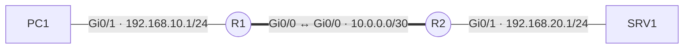

# Routage statique

## Contexte

Faire communiquer deux réseaux locaux séparés par une liaison entre routeurs, sans protocole de routage dynamique. C'est la configuration attendue sur une infrastructure de petite taille dont la topologie ne change pas.

## Prérequis

- Deux routeurs Cisco (IOS 15.x ou plus récent) avec accès console ou SSH en mode privilégié
- Les interfaces concernées adressées et actives
- Le plan d'adressage de référence des [conventions](../conventions.md)

## Topologie



## Procédure

### 1. Adresser les interfaces de R1

```cisco
enable
configure terminal
interface GigabitEthernet0/1
 description LAN utilisateurs
 ip address 192.168.10.1 255.255.255.0
 no shutdown
exit
interface GigabitEthernet0/0
 description Interconnexion vers R2
 ip address 10.0.0.1 255.255.255.252
 no shutdown
exit
```

!!! warning "`no shutdown` n'est pas optionnel"
    Une interface configurée mais laissée administrativement désactivée n'apparaît pas dans la table de routage. C'est la première cause de « la route ne remonte pas ».

### 2. Déclarer la route vers le réseau distant

```cisco
ip route 192.168.20.0 255.255.255.0 10.0.0.2
```

La syntaxe est : réseau de destination, masque, puis adresse du prochain saut.

### 3. Configurer R2 symétriquement

```cisco
enable
configure terminal
interface GigabitEthernet0/1
 ip address 192.168.20.1 255.255.255.0
 no shutdown
exit
interface GigabitEthernet0/0
 ip address 10.0.0.2 255.255.255.252
 no shutdown
exit
ip route 192.168.10.0 255.255.255.0 10.0.0.1
```

!!! tip "Le retour se configure toujours"
    Une route ne vaut que dans un sens. Sans la route retour sur R2, le ping part mais la réponse ne revient jamais.

### 4. Ajouter une route par défaut vers l'extérieur

Sur le routeur de bordure uniquement, pour tout ce qui n'est pas connu localement :

```cisco
ip route 0.0.0.0 0.0.0.0 203.0.113.1
```

### 5. Enregistrer

```cisco
end
copy running-config startup-config
```

## Plan de retour arrière

Retirer uniquement les routes ajoutées par cette procédure, sans toucher aux interfaces ni à une éventuelle route par défaut préexistante.

```cisco
configure terminal
no ip route 192.168.20.0 255.255.255.0 10.0.0.2
no ip route 0.0.0.0 0.0.0.0 203.0.113.1
end
copy running-config startup-config
```

Faire la même chose sur R2 pour la route symétrique (`no ip route 192.168.10.0 255.255.255.0 10.0.0.1`).

!!! warning "Vérifier les dépendances avant de retirer"
    Si du NAT ou une ACL s'appuie sur cette route (voir [NAT et PAT](nat-pat.md)), la retirer coupe aussi ce qui en dépend. Confirmer avec `show ip route` et `show running-config | include ip route` qu'aucune autre configuration n'en a besoin.

## Vérification

=== "Cisco IOS"

    ```cisco
    show ip route static
    show ip interface brief
    ping 192.168.20.1 source 192.168.10.1
    traceroute 192.168.20.1
    ```

    Dans `show ip route`, la route apparaît préfixée par `S` (statique) ou `S*` pour la route par défaut, avec une distance administrative de 1 : `S 192.168.20.0/24 [1/0] via 10.0.0.2`.

=== "Depuis un poste Linux"

    ```bash
    ip route show
    ping -c 4 192.168.20.10
    traceroute 192.168.20.10
    ```

=== "Depuis un poste Windows"

    ```powershell
    route print
    Test-NetConnection 192.168.20.10
    tracert 192.168.20.10
    ```

## Dépannage

| Symptôme | Cause probable | Correction |
|---|---|---|
| La route n'apparaît pas dans `show ip route` | Interface de sortie down, ou prochain saut injoignable | `show ip interface brief`, vérifier `no shutdown` et le câblage |
| Ping sans réponse alors que la route existe des deux côtés | Route retour absente | Ajouter la route symétrique sur le routeur distant |
| Ping OK depuis le routeur mais KO depuis le poste | Passerelle par défaut absente sur le poste | Vérifier la configuration IP du client ou l'étendue DHCP |
| Ping bloqué au-delà du routeur de bordure | ACL ou NAT manquant | Voir [NAT et PAT](nat-pat.md) |

!!! note "Distance administrative"
    Une route statique a une distance de 1, une route OSPF de 110. À destination égale, la statique l'emporte. Pour en faire une route de secours derrière OSPF, lui donner une distance supérieure : `ip route 192.168.20.0 255.255.255.0 10.0.0.2 200`.
