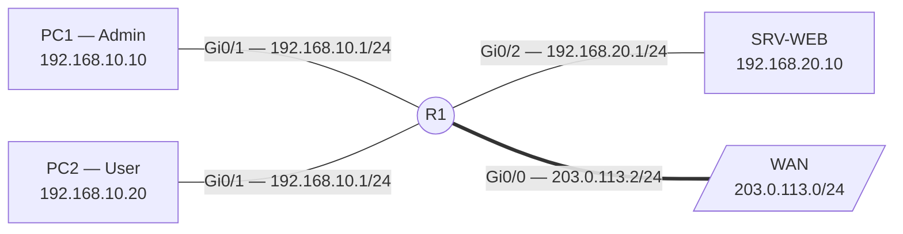

# Listes de contrôle d'accès (ACL Cisco)

## Contexte

Les ACL filtrent le trafic sur les interfaces d'un routeur ou commutateur L3. Elles examinent les en-têtes IP (couche 3) et TCP/UDP (couche 4) pour **permit** ou **deny** chaque paquet.

Usages principaux : cloisonnement inter-réseaux, restriction d'accès SSH, sélection de flux pour NAT/VPN.

---

## Règles fondamentales

!!! warning "Refus implicite"
    Toute ACL se termine par un `deny ip any any` invisible. Tout paquet sans correspondance est détruit.

| Règle | Comportement |
|---|---|
| **Premier match** | La première règle correspondante s'applique — les suivantes ne sont pas lues |
| **`in`** | Paquet filtré à l'entrée de l'interface, avant le routage |
| **`out`** | Paquet filtré à la sortie, après le routage |
| **ACL standard** | Placer **près de la destination** (filtre sur IP source uniquement) |
| **ACL étendue** | Placer **près de la source** (filtre source + destination + protocole + ports) |

---

## Masque générique (Wildcard)

$$\text{Wildcard} = 255.255.255.255 - \text{Masque de sous-réseau}$$

| CIDR | Wildcard | Raccourci IOS |
|---|---|---|
| Hôte unique `/32` | `0.0.0.0` | `host <ip>` |
| `/30` | `0.0.0.3` | — |
| `/29` | `0.0.0.7` | — |
| `/27` | `0.0.0.31` | — |
| `/24` | `0.0.0.255` | — |
| `/16` | `0.0.255.255` | — |
| Tout | `255.255.255.255` | `any` |

---

## Types d'ACL

| | ACL Standard | ACL Étendue |
|---|---|---|
| **Numérotée** | 1–99, 1300–1999 | 100–199, 2000–2699 |
| **Nommée** | `ip access-list standard <NOM>` | `ip access-list extended <NOM>` |
| **Critères** | IP source | IP src + IP dst + protocole + ports |
| **Placement** | Près de la destination | Près de la source |

!!! tip "Préférer les ACL nommées"
    Elles permettent d'insérer, modifier ou supprimer une règle précise via les numéros de séquence, sans tout réécrire.

---

## Topologie de référence



---

## Procédure

### 1. ACL standard — filtrer par IP source

```cisco
ip access-list standard BLOQUER_PC2
 deny   host 192.168.10.20
 permit 192.168.10.0 0.0.0.255

interface GigabitEthernet0/2
 ip access-group BLOQUER_PC2 out
```

---

### 2. ACL étendue — filtrage L3/L4

```cisco
ip access-list extended FILTRAGE_SERVEURS
 permit tcp 192.168.10.0 0.0.0.255 host 192.168.20.10 eq 80
 permit tcp 192.168.10.0 0.0.0.255 host 192.168.20.10 eq 443
 permit udp 192.168.10.0 0.0.0.255 host 192.168.20.10 eq 53
 permit tcp 192.168.10.0 0.0.0.255 host 192.168.20.10 eq 53
 permit icmp 192.168.10.0 0.0.0.255 host 192.168.20.10 echo
 deny   ip  192.168.10.0 0.0.0.255 192.168.20.0 0.0.0.255 log

interface GigabitEthernet0/1
 ip access-group FILTRAGE_SERVEURS in
```

**Opérateurs de port :**

| Opérateur | Syntaxe | Exemple |
|---|---|---|
| Égal | `eq <port\|service>` | `eq 443` ou `eq https` |
| Différent | `neq <port>` | `neq 23` |
| Inférieur à | `lt <port>` | `lt 1024` |
| Supérieur à | `gt <port>` | `gt 1023` |
| Plage | `range <debut> <fin>` | `range 8080 8090` |

---

### 3. Trafic de retour — option `established`

Autorise uniquement les paquets TCP retour (flags ACK ou RST) d'une connexion initiée depuis l'intérieur :

```cisco
ip access-list extended RETOUR_WAN
 permit tcp any 192.168.10.0 0.0.0.255 established
 permit udp any eq 53 192.168.10.0 0.0.0.255

interface GigabitEthernet0/0
 ip access-group RETOUR_WAN in
```

---

### 4. Restriction d'accès VTY — `access-class`

```cisco
ip access-list standard ACCES_SSH
 permit host 192.168.10.10
 deny   any log

line vty 0 4
 access-class ACCES_SSH in
 transport input ssh
```

!!! danger "Ne pas s'exclure soi-même"
    Vérifier que sa propre IP est bien dans le `permit` avant d'appliquer `access-class`, sinon la session SSH en cours se coupe immédiatement.

---

### 5. Édition en production (numéros de séquence)

Les ACL nommées numérotent automatiquement les lignes (10, 20, 30…).

```cisco
! Insérer une règle entre la 10 et la 20
ip access-list extended FILTRAGE_SERVEURS
 15 deny ip host 192.168.10.15 host 192.168.20.10

! Supprimer une règle précise
ip access-list extended FILTRAGE_SERVEURS
 no 15

! Réindexer les numéros (début 10, pas 10)
access-list resequence FILTRAGE_SERVEURS 10 10
```

---

## Plan de retour arrière

```cisco
! 1. Détacher l'ACL de l'interface
interface GigabitEthernet0/1
 no ip access-group FILTRAGE_SERVEURS in
interface GigabitEthernet0/2
 no ip access-group BLOQUER_PC2 out
line vty 0 4
 no access-class ACCES_SSH in

! 2. Supprimer les listes
no ip access-list extended FILTRAGE_SERVEURS
no ip access-list standard BLOQUER_PC2
no ip access-list standard ACCES_SSH

end
copy running-config startup-config
```

---

## Vérification

```cisco
! Règles et compteurs de correspondance
show access-lists
show access-lists FILTRAGE_SERVEURS

! Vérifier l'application sur une interface
show ip interface GigabitEthernet0/1 | include access list

! Remettre les compteurs à zéro
clear ip access-list counters FILTRAGE_SERVEURS
```

Résultat attendu de `show ip interface` :
```text
Inbound  access list is FILTRAGE_SERVEURS
Outbound access list is not set
```

---

## Dépannage

| Symptôme | Cause | Correction |
|---|---|---|
| Tout le trafic est bloqué | Refus implicite — aucune règle `permit` ne correspond | Ajouter `permit ip any any` en fin d'ACL si le filtrage ne doit être que partiel |
| Une règle de refus n'a aucun effet | Une règle `permit` plus haute intercepte le trafic en premier | Vérifier l'ordre avec `show access-lists`, remonter la règle avec un numéro de séquence inférieur |
| Le ping part mais la réponse ne revient pas | ACL bloquant `echo-reply` sur le chemin retour | Ajouter `permit icmp any any echo-reply` sur l'interface de retour |
| Compteurs à 0 malgré du trafic | ACL appliquée sur la mauvaise interface ou dans le mauvais sens | Vérifier avec `show ip interface <nom>` |
| Masque trop large ou trop restrictif | Confusion masque de sous-réseau / wildcard | Recalculer : `255.255.255.255 − masque` |
| Admin déconnecté après `access-class` | Propre IP absente du `permit` | Reconnecter via console physique, corriger l'ACL |

---

## Voir aussi

- [NAT et PAT](../reseau/nat-pat.md) — les ACL standard servent à sélectionner les flux à traduire
- [Dépannage réseau](../depannage/index.md#pare-feu-et-listes-de-controle-dacces) — diagnostic des coupures par ACL
- [Mémo Cisco IOS](../memos/cisco-ios.md) — toutes les commandes `show`
