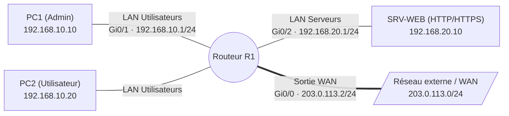

# Listes de contrôle d'accès (ACL Cisco)

## Contexte

Une liste de contrôle d'accès (**ACL** pour *Access Control List*) est un ensemble ordonné de règles séquentielles appliqué sur les interfaces d'un équipement réseau (routeur ou commutateur de niveau 3). Elle examine les en-têtes des paquets en transit aux couches 3 (réseau - IPv4/IPv6) et 4 (transport - TCP/UDP/ICMP) pour décider de les acheminer (**permit**) ou de les détruire (**deny**).

Dans une optique de cybersécurité et d'administration système :

- **Filtrage de trafic (pare-feu sans état)** : cloisonner les segments réseau (interdire aux utilisateurs d'accéder directement aux bases de données ou à la DMZ).
- **Contrôle d'accès d'administration** : restreindre les sessions SSH/Telnet sur les lignes VTY aux seules machines d'administration.
- **Sélection de flux** : identifier le trafic éligible au NAT/PAT ou aux tunnels VPN IPsec.
- **QoS et limitation de débit** : classifier les flux prioritaires ou bloquer les flux indésirables.

---

## Prérequis

- Un ou plusieurs routeurs Cisco sous Cisco IOS (version 15.x ou supérieure)
- Accès console ou SSH en mode privilégié (`enable`)
- Plan d'adressage et routage interne préalablement configurés et fonctionnels (voir [Routage statique](../reseau/routage-statique.md))

---

## Principes fondamentaux

Avant d'écrire la moindre ligne de configuration, quatre règles régissent le comportement de l'IOS Cisco :

### 1. Évaluation séquentielle et première correspondance (*First Match*)
Les règles d'une ACL sont lues **du haut vers le bas**. Dès qu'un paquet correspond aux critères d'une ligne (adresse, protocole, port), l'action associée (`permit` ou `deny`) s'applique immédiatement : l'évaluation s'arrête et aucune règle suivante n'est consultée. Les règles les plus spécifiques doivent donc toujours être placées avant les règles générales.

### 2. Le refus implicite (*Implicit Deny*)
À la fin de chaque ACL Cisco réside une règle invisible :
```text
deny ip any any
```
Tout paquet qui ne correspond à **aucune** des règles explicites de la liste est automatiquement rejeté. Pour laisser passer le reste du trafic non filtré, il est indispensable de terminer l'ACL par une règle d'autorisation globale (`permit ip any any`).

### 3. Sens d'application (`in` vs `out`)
Une ACL se lie à une interface physique ou logique dans un sens précis :

- **`in` (entrant)** : le paquet est filtré dès son arrivée sur l'interface, **avant** que le routeur ne prenne sa décision de routage. Cela économise les cycles CPU si le paquet doit être détruit.
- **`out` (sortant)** : le paquet est d'abord routé, puis filtré juste avant d'être expédié sur le support physique.

### 4. Règle de placement Cisco
- **ACL standard** : à placer **au plus près de la destination**. Comme elle ne filtre que sur l'adresse source, la placer trop tôt couperait l'accès de la source à d'autres réseaux légitimes.
- **ACL étendue** : à placer **au plus près de la source**. Comme elle filtre sur la source, la destination et le port, l'élimination précoce du trafic indésirable évite d'engorger les liaisons réseau intermédiaires.

---

## Topologie



---

## Le masque générique (Wildcard Mask)

Les ACL Cisco IPv4 n'utilisent pas la notation CIDR classique (`/24`) mais un **masque générique** (ou masque inversé) :

- Un bit à **`0`** signifie : « la valeur de ce bit dans l'adresse IP du paquet **doit correspondre exactement** ».
- Un bit à **`1`** (valeur 255 sur l'octet) signifie : « ce bit est **ignoré** (n'importe quelle valeur convient) ».

### Calcul rapide
Pour obtenir le masque générique d'un sous-réseau, soustraire le masque de sous-réseau à `255.255.255.255` :

$$\text{Masque générique} = 255.255.255.255 - \text{Masque de sous-réseau}$$

| Notation CIDR | Masque décimal | Masque générique (Wildcard) | Rôle |
|---|---|---|---|
| Hôte unique (`/32`) | `255.255.255.255` | `0.0.0.0` (ou mot-clé `host`) | Ne cible qu'une seule adresse IP |
| `/30` | `255.255.255.252` | `0.0.0.3` | Bloc de 4 adresses (interconnexion) |
| `/29` | `255.255.255.248` | `0.0.0.7` | Bloc de 8 adresses |
| `/28` | `255.255.255.240` | `0.0.0.15` | Bloc de 16 adresses |
| `/27` | `255.255.255.224` | `0.0.0.31` | Bloc de 32 adresses |
| `/26` | `255.255.255.192` | `0.0.0.63` | Bloc de 64 adresses |
| `/24` | `255.255.255.0` | `0.0.0.255` | Sous-réseau standard de 256 adresses |
| `/16` | `255.255.0.0` | `0.0.255.255` | Réseau de classe B |
| Tout le monde (`/0`) | `0.0.0.0` | `255.255.255.255` (ou mot-clé `any`) | N'importe quelle adresse IPv4 |

---

## Types d'ACL : Standards vs Étendues

| Critère | ACL Standard | ACL Étendue |
|---|---|---|
| **Numérotation standard** | `1` à `99` et `1300` à `1999` | `100` à `199` et `2000` à `2699` |
| **Nommée possible ?** | Oui (`ip access-list standard <NOM>`) | Oui (`ip access-list extended <NOM>`) |
| **Critères filtrés** | Uniquement l'**adresse IP source** | IP source, IP destination, protocole (TCP, UDP, ICMP, IP), ports source et destination, flags TCP |
| **Emplacement recommandé** | Au plus près de la **destination** | Au plus près de la **source** |
| **Usage type** | Restriction VTY d'administration, NAT simple | Filtrage inter-VLAN, sécurité DMZ, pare-feu périmétrique |

!!! tip "Préférer les ACL nommées aux ACL numérotées"
    Les ACL nommées (`ip access-list standard|extended <NOM>`) permettent d'insérer ou de supprimer une ligne précise grâce aux **numéros de séquence**, sans devoir supprimer et retaper toute la liste comme avec les anciennes ACL numérotées.

---

## Procédure

### 1. ACL standard : restreindre un poste ou un sous-réseau

Scénario : sur le réseau utilisateurs (`192.168.10.0/24`), interdire au poste non conforme `PC2` (`192.168.10.20`) d'accéder aux serveurs, tout en autorisant les autres postes du LAN.

```cisco
enable
configure terminal

! Création de l'ACL standard nommée
ip access-list standard BLOQUER_PC2
 remark Interdiction specifique du PC2 vers la zone serveurs
 deny host 192.168.10.20
 remark Autorisation de tous les autres postes du sous-reseau
 permit 192.168.10.0 0.0.0.255
exit

! Application au plus pres de la destination (sur l'interface de sortie vers les serveurs)
interface GigabitEthernet0/2
 description LAN Serveurs
 ip access-group BLOQUER_PC2 out
exit
```

!!! warning "Ne pas oublier l'autorisation explicite"
    Si la ligne `permit 192.168.10.0 0.0.0.255` était omise, le refus implicite final bloquerait **tous** les postes du sous-réseau `192.168.10.0/24`.

---

### 2. ACL étendue : filtrage applicatif (L3 + L4)

Scénario : sécuriser le LAN Serveurs (`192.168.20.0/24`). Les utilisateurs du LAN peuvent :

1. Consulter le serveur Web (`192.168.20.10`) en HTTP (port 80) et HTTPS (port 443).
2. Interroger le serveur DNS interne (port 53 en UDP et TCP).
3. Effectuer des requêtes Ping (`icmp echo`).
4. Tout autre trafic venant des utilisateurs vers les serveurs doit être bloqué et consigné dans les logs.

```cisco
enable
configure terminal

ip access-list extended FILTRAGE_VERS_SERVEURS
 remark --- 1. Autoriser HTTP et HTTPS vers le serveur Web ---
 permit tcp 192.168.10.0 0.0.0.255 host 192.168.20.10 eq 80
 permit tcp 192.168.10.0 0.0.0.255 host 192.168.20.10 eq 443

 remark --- 2. Autoriser les requetes DNS vers le serveur ---
 permit udp 192.168.10.0 0.0.0.255 host 192.168.20.10 eq 53
 permit tcp 192.168.10.0 0.0.0.255 host 192.168.20.10 eq 53

 remark --- 3. Autoriser les pings de diagnostic ---
 permit icmp 192.168.10.0 0.0.0.255 host 192.168.20.10 echo

 remark --- 4. Journaliser les rejets explicites ---
 deny ip 192.168.10.0 0.0.0.255 192.168.20.0 0.0.0.255 log
exit

! Application au plus pres de la source (trafic entrant depuis le LAN utilisateurs)
interface GigabitEthernet0/1
 ip access-group FILTRAGE_VERS_SERVEURS in
exit
```

#### Opérateurs de ports disponibles
- `eq <port|service>` : égal à (ex: `eq 80` ou `eq www`, `eq 22` ou `eq ssh`)
- `neq <port>` : différent de
- `lt <port>` : strictement inférieur à
- `gt <port>` : strictement supérieur à
- `range <port-debut> <port-fin>` : plage de ports (ex: `range 1024 65535`)

---

### 3. Filtrage du trafic de retour : l'option `established`

Sur un filtrage TCP étendu, quand des machines locales initient une connexion vers l'extérieur (ex: consultation du Web), les paquets de retour reviennent par l'interface WAN. L'option `established` n'autorise les paquets TCP entrants que si les flags **ACK** ou **RST** sont armés (ce qui prouve que la connexion a été amorcée depuis l'intérieur) :

```cisco
ip access-list extended RETOUR_INTERNET
 remark Autoriser uniquement les reponses TCP aux connexions internes
 permit tcp any 192.168.10.0 0.0.0.255 established
 remark Autoriser les reponses DNS entrantes
 permit udp any eq 53 192.168.10.0 0.0.0.255
exit

interface GigabitEthernet0/0
 ip access-group RETOUR_INTERNET in
exit
```

---

### 4. Sécuriser les accès d'administration VTY (`access-class`)

Pour empêcher n'importe quel poste du réseau de tenter des attaques par force brute sur la console SSH du routeur, on restreint l'accès aux seules lignes VTY avec la commande `access-class` :

```cisco
enable
configure terminal

! ACL standard ne laissant passer que l'IP du poste d'administration
ip access-list standard ACCES_ADMIN_SSH
 remark Autoriser uniquement le PC1 d'administration
 permit host 192.168.10.10
 deny any log
exit

! Application sur les lignes distantes (VTY 0 a 4)
line vty 0 4
 access-class ACCES_ADMIN_SSH in
 transport input ssh
exit
end
copy running-config startup-config
```

!!! tip "Ne pas bloquer son propre accès"
    S'assurer d'inclure sa propre adresse IP dans la règle `permit` avant d'appliquer l'`access-class`, sous peine d'être déconnecté immédiatement de la session SSH en cours.

---

### 5. Modification et réordonnancement d'une ACL en production

Dans les ACL nommées, chaque ligne reçoit un numéro de séquence (par défaut incrémenté de 10 : 10, 20, 30...).

#### Insérer une règle entre deux règles existantes
Pour ajouter une interdiction pour `192.168.10.15` avant la règle numéro 20 :

```cisco
configure terminal
ip access-list extended FILTRAGE_VERS_SERVEURS
 15 deny ip host 192.168.10.15 host 192.168.20.10
exit
```

#### Supprimer une seule règle sans toucher au reste
```cisco
configure terminal
ip access-list extended FILTRAGE_VERS_SERVEURS
 no 15
exit
```

#### Réindexer les numéros de séquence (`resequence`)
Après plusieurs ajouts et suppressions, réaligner les numéros de séquence (début à 10, pas de 10) :

```cisco
access-list resequence FILTRAGE_VERS_SERVEURS 10 10
```

---

## Plan de retour arrière

Pour annuler un filtrage sans risquer d'effacer la configuration globale :

### 1. Détacher l'ACL de l'interface en priorité
Détacher d'abord la règle rétablit instantanément le flux normal sans détruire la définition de l'ACL :

```cisco
configure terminal
interface GigabitEthernet0/1
 no ip access-group FILTRAGE_VERS_SERVEURS in
exit
interface GigabitEthernet0/2
 no ip access-group BLOQUER_PC2 out
exit
line vty 0 4
 no access-class ACCES_ADMIN_SSH in
exit
```

### 2. Supprimer la liste de contrôle d'accès
Une fois désassociée :

```cisco
no ip access-list extended FILTRAGE_VERS_SERVEURS
no ip access-list standard BLOQUER_PC2
no ip access-list standard ACCES_ADMIN_SSH
end
copy running-config startup-config
```

---

## Vérification

### 1. Afficher les règles et les compteurs de correspondance
La commande reine permet de voir chaque règle ainsi que le nombre de paquets l'ayant déclenchée (*match counters*) :

```cisco
show access-lists
```

Exemple de sortie :
```text
Extended IP access list FILTRAGE_VERS_SERVEURS
    10 permit tcp 192.168.10.0 0.0.0.255 host 192.168.20.10 eq www (245 matches)
    20 permit tcp 192.168.10.0 0.0.0.255 host 192.168.20.10 eq 443 (1820 matches)
    30 permit udp 192.168.10.0 0.0.0.255 host 192.168.20.10 eq domain (54 matches)
    40 permit icmp 192.168.10.0 0.0.0.255 host 192.168.20.10 echo (16 matches)
    50 deny ip 192.168.10.0 0.0.0.255 192.168.20.0 0.0.0.255 log (38 matches)
```

Si le compteur augmente, la règle est fonctionnelle.

### 2. Remettre les compteurs à zéro pour un test ciblé
```cisco
clear ip access-list counters FILTRAGE_VERS_SERVEURS
```

### 3. Vérifier l'application sur les interfaces
```cisco
show ip interface GigabitEthernet0/1 | include access list
```

Résultat attendu :
```text
  Inbound  access list is FILTRAGE_VERS_SERVEURS
  Outbound access list is not set
```

### 4. Tests de validation depuis les hôtes

=== "Depuis PC1 (Admin - 192.168.10.10)"
    ```bash
    # Test HTTP vers le serveur (doit fonctionner)
    curl -I http://192.168.20.10
    # Test Ping (doit fonctionner)
    ping 192.168.20.10
    # Connexion d'administration au routeur (doit fonctionner)
    ssh admin@192.168.10.1
    ```

=== "Depuis PC2 (Utilisateur - 192.168.10.20)"
    ```bash
    # Test HTTP vers le serveur (doit fonctionner si non restreint par l'ACL standard)
    curl -I http://192.168.20.10
    # Test SSH vers le routeur (doit etre refuse par l'access-class)
    ssh admin@192.168.10.1
    # Resultat attendu : Connection refused ou Connection timed out
    ```

---

## Dépannage

| Symptôme | Cause probable | Correction |
|---|---|---|
| **Tout le trafic est bloqué** dès l'application de l'ACL | Refus implicite final déclenché (`deny ip any any`) | Ajouter une règle explicite `permit ip any any` à la fin si l'ACL n'a vocation qu'à bloquer des flux spécifiques. |
| **Une règle d'interdiction ne fonctionne pas** (le trafic passe quand même) | Une règle plus permissive placée plus haut dans la liste intercepte le trafic en premier (*First Match*) | Consulter l'ordre exact avec `show access-lists`. Déplacer la règle d'interdiction avant la règle permissive via les numéros de séquence. |
| **Le ping part mais la réponse ne revient pas** | Le paquet d'aller est autorisé mais le retour est bloqué dans l'autre sens par une ACL ou un manque d'`established` | Vérifier les ACL sur le chemin inverse ou ajouter `permit icmp any any echo-reply`. |
| **ACL active mais compteurs à 0 matches** | L'ACL est appliquée sur la mauvaise interface ou dans le mauvais sens (`in` au lieu de `out`) | Vérifier avec `show ip interface <nom>`. Réappliquer dans le sens approprié. |
| **Masque générique erroné** (cible trop large ou trop étroite) | Confusion entre masque de sous-réseau et wildcard (ex: `255.255.255.0` au lieu de `0.0.0.255`) | Corriger le masque avec la formule `255.255.255.255 - masque`. Utiliser `host <ip>` pour une machine unique. |
| **L'administrateur s'est enfermé hors du routeur** en configurant `access-class` | L'adresse de gestion de l'admin n'était pas autorisée dans l'ACL VTY | Se reconnecter par le port console physique (non affecté par les lignes VTY) et corriger ou retirer l'ACL avec `no access-class`. |

---

## Voir aussi

- [NAT et PAT](../reseau/nat-pat.md) — utilisation des ACL standard pour définir les flux à traduire
- [Routage statique](../reseau/routage-statique.md) — routage inter-réseaux nécessaire avant tout filtrage
- [Dépannage réseau](../depannage/index.md#pare-feu-et-listes-de-controle-dacces) — guide de diagnostic des coupures par ACL
- [Mémo Cisco IOS](../memos/cisco-ios.md) — rappel des modes de configuration et commandes `show`
